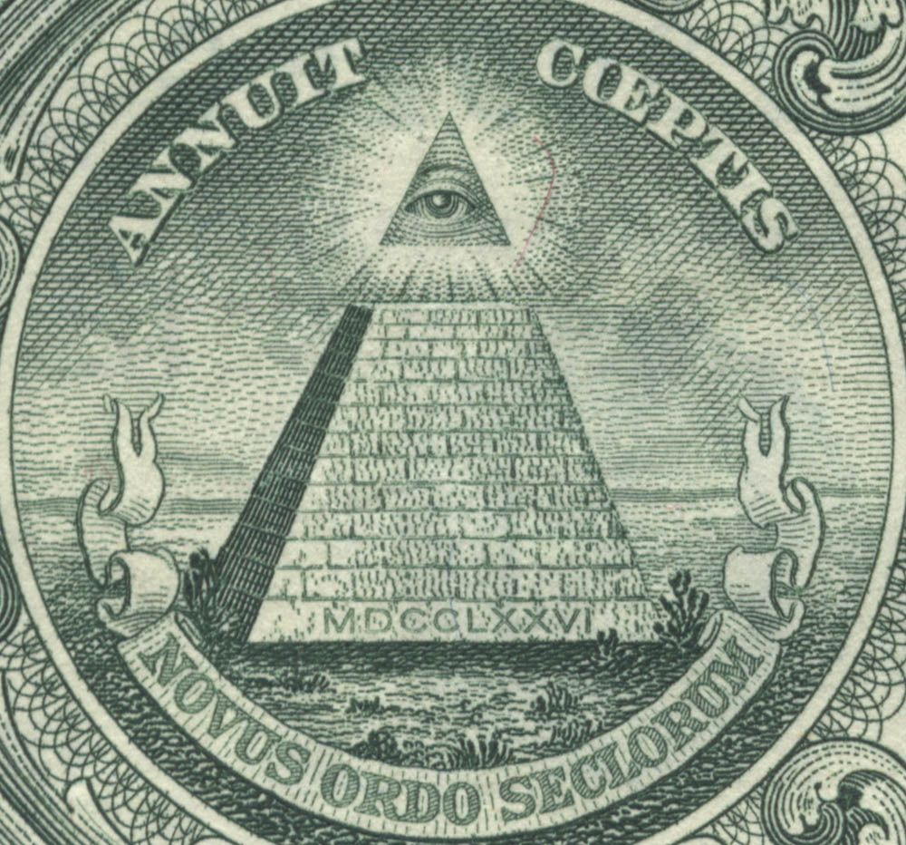

## Binance-Bot

---

The bot sorts coins by popular technical indicators, which actually harm rather than help to trade in a plus.

Written for the sake of interest in a functional style (without using currying and composition), the code is fully extensible. Plans to rewrite to TypeScript

Further development is seen in the direction of abandoning technical indicators and creating your own algorithm.

---

